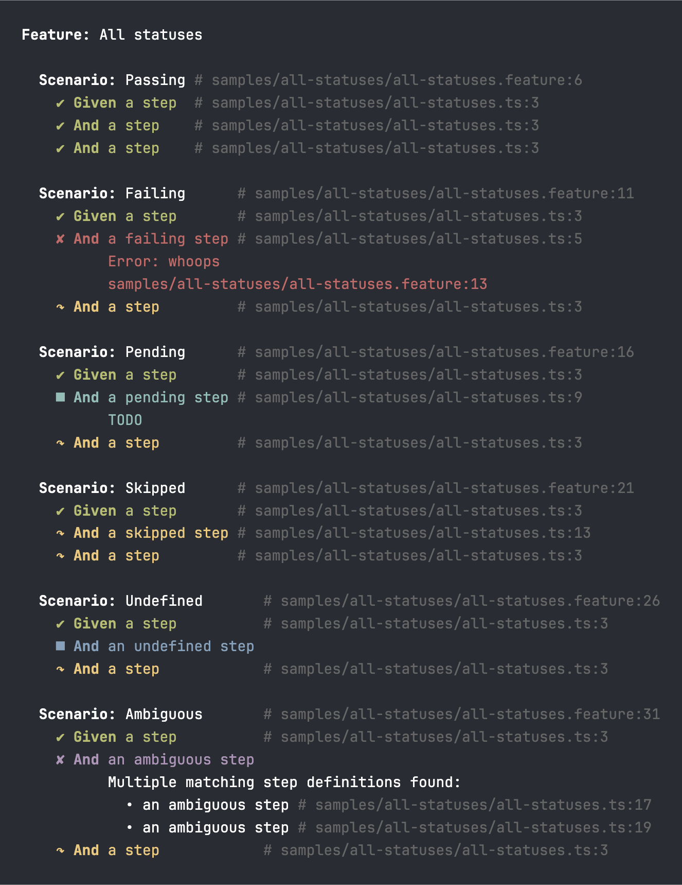
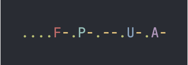
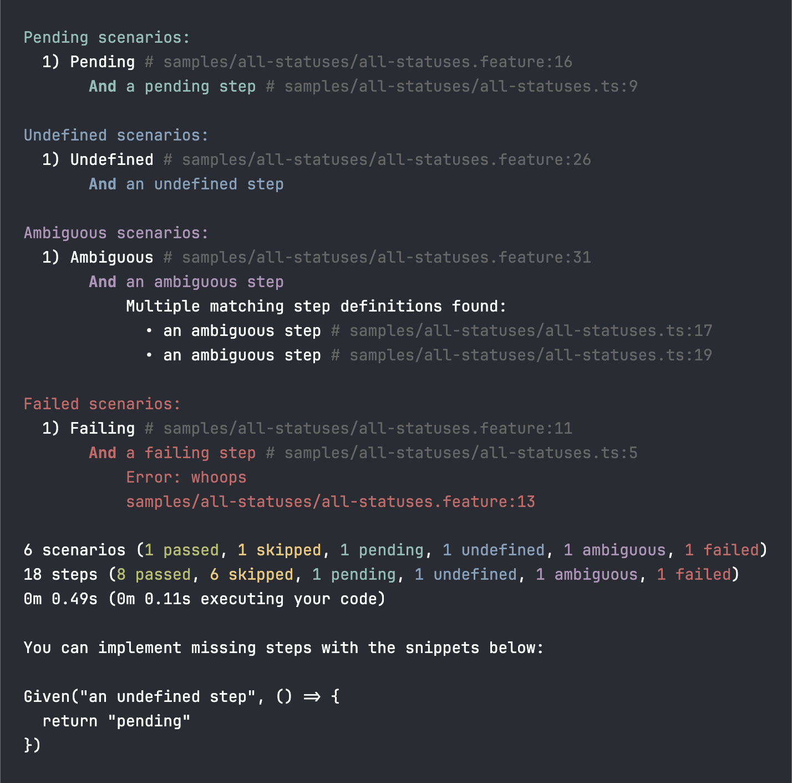

<h1 align="center">
  
   
  pretty-formatter
</h1>

  <b>Rich formatting of Cucumber progress and results for the terminal</b>

  
  

  
  

This package provides several printers and utilities for rich formatting of Cucumber progress and results in the terminal.

## Pretty

The pretty formatter writes a rich report of the scenario and example execution as it happens. Useful when running Cucumber from the terminal.

## Progress

The progress formatter is minimalist progress indicator that writes a single character status for each test. Useful the test suite gets large. Pairs well with the summary formatter.

## Summary

The summary formatter writes a rich summary at the end of the test run.

## Test outcome coloring

Each step is colored according to the outcome. When the `cucumber` theme is in
use the following colors and symbols are used.

| Cucumber Outcome | Color   | Status Symbol | Progress Symbol |
|------------------|---------|---------------|-----------------|
| UNKNOWN          | n/a     | n/a           | n/a             |
| PASSED           | Green   | ✔             | .               |
| SKIPPED          | Yellow  | ↷             | -               |
| PENDING          | Cyan    | ■             | P               |
| UNDEFINED        | Blue    | ■             | U               |
| AMBIGUOUS        | Magenta | ✘             | A               |
| FAILED           | Red     | ✘             | F               |

## Usage and installation

* [Java](./java/README.md)
* [JavaScript](./javascript/README.md)

## Contributing

Each language implementation validates itself against the examples in the
`testdata` folder. See the [testdata/README.md](testdata/README.md) for more
information.
